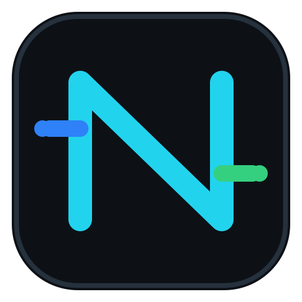
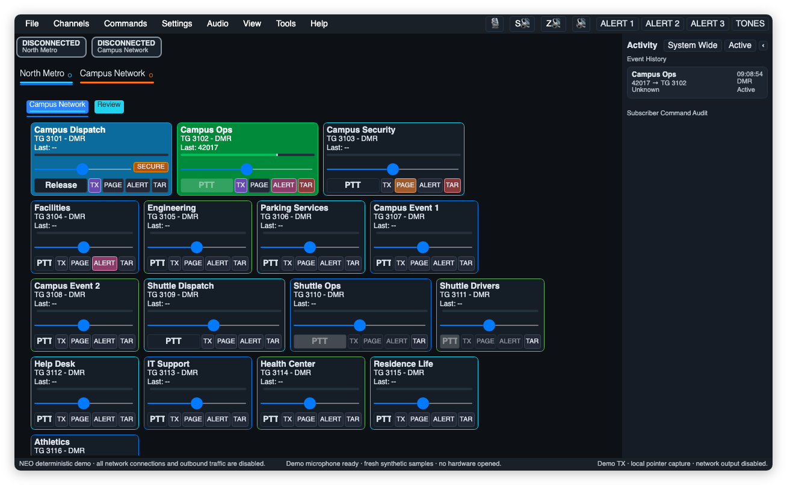
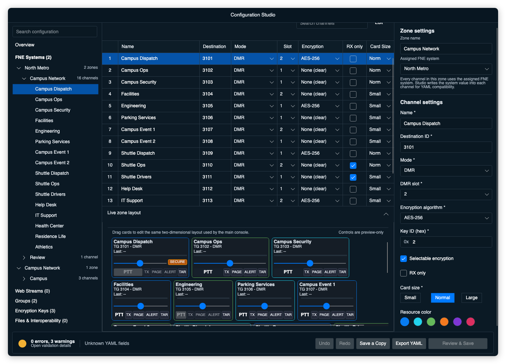

<div align="center">



# DVM Console NEO

### Multi-system DVM operation from one desktop

Monitor and transmit across DMR, P25 Phase 1, and NXDN 4800 FNE talkgroups.
Route patches, send pages and alerts, and review recordings without leaving the
macOS or Windows operator workspace.

For amateur and educational use. **Not for public- or life-safety operation.**

[](https://github.com/RdWing/dvmconsole/releases/latest)
[](https://github.com/RdWing/dvmconsole/actions/workflows/build.yml)
[](#download-dvm-console)
[](#download-dvm-console)
[](LICENSE)

[Download](https://github.com/RdWing/dvmconsole/releases/latest) ·
[User guide](docs/user-guide/Getting%20Started/01-Overview.md) ·
[What’s new](#whats-new-in-dvm-console-neo) ·
[Changelog](CHANGELOG.md) ·
[Issues](https://github.com/RdWing/dvmconsole/issues)

<picture>
  <source media="(prefers-color-scheme: dark)" srcset="repo/neo-dark.png">
  <source media="(prefers-color-scheme: light)" srcset="repo/neo-light.png">
  
</picture>

<sub>Public example configuration shown; no operational system data is included.</sub>

<picture>
  
</picture>

<sub>Configuration Studio shown with the sanitized demo codeplug.</sub>

</div>

## One workspace, independent channels

Systems and zones organize the channel cards, but each channel keeps its own
receive, volume, routing, encryption, and recording state. Global and
active-system PTT cover broader transmit routes. Adaptive receive timing and
isolated audio state keep simultaneous calls separate.

| Operator need | NEO capability |
| --- | --- |
| **Maintain live RX continuity** | Independent receive work per channel, stream-isolated call state, and adaptive packet-aligned jitter handling for P25, DMR, and NXDN. |
| **Quiet the room without losing evidence** | Mute all RX, the selected system, or the selected zone without stopping decode, call state, patching, or TAR recording. |
| **Control exactly what transmits** | Per-channel, global, active-system, patch, and multi-select routing with explicit PTT, TX, PAGE, and ALERT selection. |
| **Investigate receive problems** | Activity and Event History, embedded recording metadata, redacted Debug Log export, and separate network, decoder, mixer, and output-device diagnostics. |
| **Run on a supported workstation** | Packages for Apple Silicon macOS, Intel macOS, and Windows x64. |

## What’s new in DVM Console NEO

### 0.5.1 — Windows transmit audio hotfix

Version 0.5.1 addresses a reported Windows transmit audio problem. Diagnostic
logs showed outbound P25 packets drifting well beyond their intended cadence
when timer wakeups ran late.

- Schedule outbound audio against absolute 20 ms deadlines so one late wakeup
  does not shift every packet that follows.
- Rebase safely if transmission falls a full frame behind instead of sending a
  burst of catch-up packets.
- Use the same scheduler for patch forwarding while retaining its existing
  initial delay and bounded backlog protection.
- Add deterministic coverage for repeated timer overshoot, delayed patch start,
  clock-frequency conversion, and no-burst recovery.

[Read the 0.5.1 release notes →](docs/releases/v0.5.1.md)

### Prior recent improvements

Recent releases also include these changes:

- **0.5.0 — Configuration Studio:** added graphical codeplug editing, layout
  previews, validation, atomic saves, sanitized exports, playback stop, and
  generated-audio monitoring.
- **0.4.4 — Connection, audio, and runtime hardening:** improved stalled FNE
  recovery, unified channel meters, bounded media queues, and strengthened TAR
  and session lifecycle handling.
- **0.4.3 — Efficiency and alert audio update:** reduced package size and idle
  work, summarized jitter evidence, and corrected pacing for generated and
  imported alert audio.
- **0.4.2 — Secure voice and live reconfiguration update:** corrected
  selectable-encryption receive behavior and secure voice signaling, preserved
  transmit-tail cadence, and made patch and session changes take effect safely.
- **0.4.1 — Reliability and toolbar update:** made toolbar overflow
  scale-aware, preserved scrolled History positions, made audio-route changes
  transactional, and hardened receive-episode and session teardown.

[Read the 0.5.0 release notes →](docs/releases/v0.5.0.md) · [Read the 0.4.4 release notes →](docs/releases/v0.4.4.md) · [Read the 0.4.3 release notes →](docs/releases/v0.4.3.md) · [Read the 0.4.2 release notes →](docs/releases/v0.4.2.md)

## Download DVM Console NEO

Download the package for the destination computer and extract the entire
archive before starting DVM Console NEO. Version 0.5.1 uses these filenames:

| Platform | Package | Requirements |
| --- | --- | --- |
| Apple Silicon Mac | `dvmconsole-0.5.1-osx-arm64.zip` | macOS 14 or newer |
| Intel Mac | `dvmconsole-0.5.1-osx-x64.zip` | macOS 14 or newer |
| Windows PC | `dvmconsole-0.5.1-win-x64.zip` | Windows x64 |

**[Download the latest release →](https://github.com/RdWing/dvmconsole/releases/latest)**

> [!IMPORTANT]
> DVMHost/FNE R06A00 or newer is recommended. DVMConsole R02A00 has limited
> backwards compatibility with older FNE builds and older codeplugs. Review
> codeplugs created for R01A00 before using them with R02A00.

<details>
<summary><strong>Install on macOS</strong></summary>

1. Extract the complete ZIP and move `DVMConsole.app` to `Applications`.
2. The current package is unsigned. For an archive downloaded from the RdWing
   GitHub Release, remove its quarantine attribute:

   ```sh
   xattr -dr com.apple.quarantine "/Applications/DVMConsole.app"
   ```

3. Open DVM Console NEO normally and use **Open Codeplug** to load `codeplug.yml`.

macOS may request local-network access for FNE, microphone access for PTT, and
Accessibility or Input Monitoring access for OS-global PTT.

If the application closes immediately, preserve
`~/Library/Application Support/DVMProject/dvmconsole/LastCrash.log` before
starting it again.

</details>

<details>
<summary><strong>Install on Windows x64</strong></summary>

1. Choose **Extract All** in File Explorer.
2. Start `DvmConsole.exe` from the extracted folder.
3. Use **Open Codeplug** to load `codeplug.yml`.

If Microsoft Defender SmartScreen warns about the unsigned package, continue
only after confirming that the archive came from an RdWing GitHub Release.
If the application closes unexpectedly, preserve
`%APPDATA%\DVMProject\dvmconsole\LastCrash.log` before starting it again.

</details>

## What operators can do

- Monitor and transmit on DMR, P25 Phase 1, and NXDN 4800 FNE talkgroups.
- Organize resources by system and zone, with separate receive and routing
  controls for each channel.
- Key individual channels, every TX-selected channel, or TX-selected channels
  in the active system using on-screen, keyboard, or configured serial PTT.
- Build patch and multi-select groups while keeping each channel's state
  independent.
- Send DTMF, generated tones, Quick Call II pages, saved tone patterns, and
  custom alert audio through selected resources.
- Record talkgroup audio locally as Ogg Opus, with catalog metadata embedded in
  each file.
- Use P25 FNE/KMM key delivery with a local fallback, plus protocol-scoped local
  privacy keys for DMR and NXDN.
- Follow the system-default audio devices or pin specific microphone and speaker
  routes.
- Use DVM Console microphone processing on macOS and Windows, with optional
  device-dependent Windows communications processing on supported endpoints.

> [!NOTE]
> DVM Console NEO connects to DVM FNE peers. It does not directly control base or
> mobile radios. NXDN 9600/EFR and P25 Phase 2 transport are not implemented.

For a DVM-compatible console that supports direct base or mobile radio
interfaces, see [RadioConsole2](https://github.com/W3AXL/RadioConsole2) and
[rc2-dvm](https://github.com/W3AXL/rc2-dvm).

## User guide

| If you want to… | Read… |
| --- | --- |
| Understand systems, zones, channels, and the main console | [Overview](docs/user-guide/Getting%20Started/01-Overview.md) |
| Create a codeplug and connect to FNE | [Codeplug creation](docs/user-guide/Getting%20Started/03-Configurations/01-Codeplug%20Creation.md) |
| Configure PTT, routes, History, and operator controls | [Console operation](docs/user-guide/Getting%20Started/04-Operations/01-Console%20Operation.md) |
| Configure microphones, speakers, microphone processing, and RX processing | [Audio settings](docs/user-guide/Getting%20Started/04-Operations/03-Audio%20Settings.md) |
| Configure encryption and inspect key status | [Encryption keys](docs/user-guide/Getting%20Started/03-Configurations/02-Encryption%20Keys.md) |
| Configure and manage local recordings | [Talkgroup Audio Recorder](docs/user-guide/Getting%20Started/03-Configurations/05-Talkgroup%20Audio%20Recorder.md) |
| Build or package the application | [Building and packaging](docs/user-guide/Getting%20Started/02-Building.md) |

`Help > Documentation` opens the operator guide.

## Open source and project lineage

This repository is an independently maintained downstream version of
[DVMProject/dvmconsole](https://github.com/DVMProject/dvmconsole). RdWing
maintains the NEO releases. They are not official DVMProject releases and do not
imply DVMProject endorsement.

Development takes place in public under the AGPL-3.0-only license. Report
reproducible defects through GitHub Issues, use Discussions for setup and field
testing, and send security reports through GitHub private vulnerability
reporting.

## Build from source

The repository targets .NET 10 and includes a native Rust component. Install
the .NET 10 SDK, Rust 1.85 or newer, CMake, and the platform C/C++ toolchain.

```sh
git clone --recurse-submodules https://github.com/RdWing/dvmconsole.git
cd dvmconsole
git submodule update --init --recursive
dotnet restore dvmconsole.sln
dotnet build dvmconsole.sln
```

Use the root `dvmconsole.sln`. The build compiles native components
automatically. Repository scripts handle publishing, package verification, and
macOS smoke tests. Run the deterministic, network-disabled demo with `--demo`.

## Network, configuration, and safety

> [!WARNING]
> The current FNE plaintext and legacy encrypted transports are compatibility
> protocols, not mutually authenticated sessions. Use FNE only across a trusted
> network or an authenticated VPN.

Files tracked under `configs` are public examples. Do not commit operational
codeplugs, clear key files, aliases, recordings, crash logs, or exported
diagnostics; they may contain private information.

### Configuration support policy

Project maintainers cannot validate configurations that AI/LLM tools such as
ChatGPT, Copilot, Gemini, Claude, or similar services have generated, rewritten,
modified, or "fixed."

These tools can produce valid YAML while changing required values, removing
important comments, inventing unsupported options, breaking network or site
relationships, or creating unsafe or nonfunctional configurations.

If an AI/LLM tool read, changed, or generated a configuration, disclose that use
and reproduce the problem with a human-reviewed configuration before requesting
help.

The example configuration includes this notice so people and automated tools
see it before changing the file.

> DVMHost/FNE R06A00 or newer is recommended.

DVM Console NEO is for amateur and educational use. It is not for public- or
life-safety operation.

## License

DVM Console NEO is free software licensed under the
[GNU Affero General Public License, version 3](LICENSE). Third-party license
terms and notices distributed with the project are included in that file.
