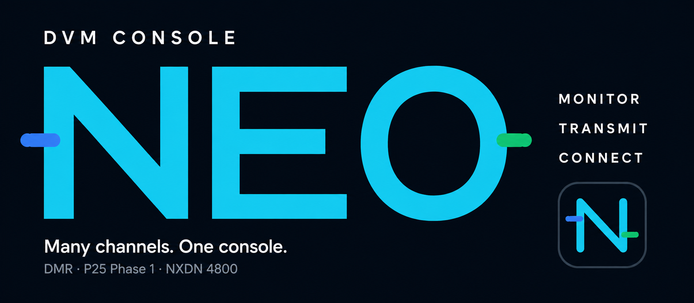

<p>

</p>

**DVM Console NEO** is an open-source radio console for DVM FNE on macOS, Windows,
and Linux. Monitor channels, transmit across systems, build patches,
and review recorded calls from one desktop.

**[Download](#download-dvm-console-neo)** ·
[Set up your console](#build-your-configuration-in-studio) ·
[User guide](docs/user-guide/Getting%20Started/01-Overview.md) ·
[What’s new](#whats-new-in-dvm-console-neo)

[](https://github.com/RdWing/dvmconsole/releases/latest)
[](https://github.com/RdWing/dvmconsole/actions/workflows/build.yml)
[](LICENSE)

<picture>
  <source media="(prefers-color-scheme: dark)" srcset="repo/neo-dark.png">
  <source media="(prefers-color-scheme: light)" srcset="repo/neo-light.png">
  
</picture>

<sub>Public demo configuration. Live connections and outbound traffic are disabled.</sub>

For amateur and educational use. **Not for public- or life-safety operation.**

## Download DVM Console NEO

Choose the package for your computer. Extract ZIP archives before launching;
Linux AppImages run as a single executable. Check the release page for the
latest downloads. The latest packages are listed below:

| Platform | Package | Requirements |
| --- | --- | --- |
| Apple Silicon Mac | `dvmconsole-0.7.0-osx-arm64.zip` | macOS 14+ supported; macOS 12–13 best effort |
| Intel Mac | `dvmconsole-0.7.0-osx-x64.zip` | macOS 14+ supported; macOS 12–13 best effort |
| Windows x64 | `dvmconsole-0.7.0-win-x64.zip` | Windows x64 |
| Windows ARM64 | `dvmconsole-0.7.0-win-arm64.zip` | Windows ARM64 |
| Linux x64 | `DVMConsole-0.7.0-x86_64.AppImage` | x64 Linux with PipeWire and GLIBC 2.34+ |
| Linux ARM64 | `DVMConsole-0.7.0-aarch64.AppImage` | ARM64 Linux with PipeWire and GLIBC 2.34+ |

**[Download the latest release →](https://github.com/RdWing/dvmconsole/releases/latest)**

The macOS packages have a macOS 12 deployment floor. macOS 12–13 are
best-effort compatibility targets; macOS 14 and newer remain officially
supported and CI-tested.

> [!WARNING]
> Version 0.7.0 stores NEO data in `DVMProject/dvmconsole-neo` instead of the
> legacy `DVMProject/dvmconsole` directory shared with the WPF application. On
> a pristine first launch, an optional assistant can import selected settings
> profiles and managed configurations. Nothing is selected automatically, and
> recordings, logs, unknown files, and the original directory are left alone.

> [!IMPORTANT]
> DVMHost/FNE R06A00 or newer is recommended. DVMConsole R02A00 has limited
> backwards compatibility with older FNE builds and older codeplugs. Review
> codeplugs created for R01A00 before using them with R02A00.

<details>
<summary><strong>Install on macOS</strong></summary>

1. Extract the complete ZIP and move `DVMConsole.app` to `Applications`.
2. The current package is unsigned. For an archive downloaded from the RdWing
   GitHub Release, remove its quarantine attribute:

   ```sh
   xattr -dr com.apple.quarantine "/Applications/DVMConsole.app"
   ```

3. Open DVM Console NEO. Choose **File > New Configuration** to build a
   codeplug in Studio, or **Import Codeplug** to add an existing YAML file to
   the managed Configuration Library.

macOS may request local-network access for FNE, microphone access for PTT, and
Accessibility or Input Monitoring access for OS-global PTT.

If the application closes immediately, preserve
`~/Library/Application Support/DVMProject/dvmconsole-neo/LastCrash.log` before
starting it again.

</details>

<details>
<summary><strong>Install on Windows</strong></summary>

1. Download the archive that matches the computer's x64 or ARM64 architecture,
   then choose **Extract All** in File Explorer.
2. Start `DvmConsole.exe` from the extracted folder.
3. Choose **File > New Configuration** to start in Studio, or **Import Codeplug**
   to add an existing YAML file to the managed Configuration Library.

If Microsoft Defender SmartScreen warns about the unsigned package, continue
only after confirming that the archive came from an RdWing GitHub Release.
If the application closes unexpectedly, preserve
`%APPDATA%\DVMProject\dvmconsole-neo\LastCrash.log` before starting it again.

</details>

<details>
<summary><strong>Install on Linux</strong></summary>

1. Download the AppImage that matches the computer's x64 or ARM64 architecture.
2. Make it executable, replacing the filename with the package you downloaded:

   ```sh
   chmod +x DVMConsole-0.7.0-x86_64.AppImage
   ```

3. Run the AppImage. Choose **File > New Configuration** to start in Studio,
   or **Import Codeplug** to add an existing YAML file to the managed library.

DVM Console uses PipeWire for audio. On X11, global keyboard PTT uses the X11
RECORD extension. On supported Wayland desktops it uses the XDG
GlobalShortcuts portal. Newer portal releases require the AppImage to be
integrated with the desktop menu so the portal can identify the application;
otherwise focused-window, card, and serial PTT remain available. If the
application closes unexpectedly, preserve
`$XDG_CONFIG_HOME/DVMProject/dvmconsole-neo/LastCrash.log`, normally
`~/.config/DVMProject/dvmconsole-neo/LastCrash.log`, before starting it again.

</details>

## Build your configuration in Studio

Start with **File > New Configuration**. Add FNE systems, zones, channels,
aliases, encryption keys, web streams, and groups without writing YAML.
Use **Review & Save** to check and save your draft, then **Disconnect and load**
to start using it.
You can also import an existing codeplug and its companion files.


<sub>Configuration Studio with the public demo codeplug.</sub>

Once your configuration is loaded, choose your microphone and speakers in
**Audio > Audio settings**, connect to the FNE, and select the channels you want
to hear. You can also set up groups and choose which channels to record.

[Create your first configuration →](docs/user-guide/Getting%20Started/03-Configurations/01-Codeplug%20Creation.md) ·
[Audio setup](docs/user-guide/Getting%20Started/04-Operations/03-Audio%20Settings.md) ·
[Groups and patching](docs/user-guide/Getting%20Started/03-Configurations/04-Groups%20and%20Patching.md)

## Independent channels. Shared workspace.

Each channel keeps its own receive, volume, routing, encryption, and recording
state. Organize channels into systems and zones, then use card, global, or
active-system PTT to choose which channels you transmit on.

| Listen | Transmit | Review |
| --- | --- | --- |
| Monitor DMR, P25 Phase 1, NXDN 4800, and local web streams. | Use channel PTT, multi-select groups, and cross-protocol patches. | Record selected calls with TAR and play them from Event History. |
| Route channels to different speakers; mute a zone or system without stopping recordings. | Send pages, tones, DTMF, and custom alert audio through selected routes. | Inspect call metadata and export redacted diagnostics when troubleshooting. |

<details>
<summary>More operating capabilities and protocol support</summary>


- Monitor and transmit on DMR, P25 Phase 1, and NXDN 4800 FNE talkgroups.
- Organize resources by system and zone, with separate receive and routing
  controls for each channel.
- Key individual channels, every TX-selected channel, or TX-selected channels
  in the active system using on-screen, keyboard, or configured serial PTT.
- Build patch and multi-select groups while keeping each channel's state
  independent.
- Send DTMF, generated tones, Quick Call II pages, saved tone patterns, and
  custom alert audio through selected resources.
- Record talkgroup audio locally as Ogg Opus, with catalog metadata embedded in
  each file.
- Use P25 FNE/KMM key delivery with a local fallback, plus protocol-scoped local
  privacy keys for DMR and NXDN.
- Follow the system-default audio devices or pin specific microphone and speaker
  routes.
- Use DVM Console microphone processing on macOS, Windows, and Linux, with
  optional device-dependent Windows communications processing on supported
  endpoints.

> [!NOTE]
> DVM Console NEO connects to DVM FNE peers. It does not directly control base or
> mobile radios. NXDN 9600/EFR and P25 Phase 2 transport are not implemented.

For a DVM-compatible console that supports direct base or mobile radio
interfaces, see [RadioConsole2](https://github.com/W3AXL/RadioConsole2) and
[rc2-dvm](https://github.com/W3AXL/rc2-dvm).

</details>

## What’s new in DVM Console NEO

### 0.7.0: More platforms, easier setup, and dependable operation

Version 0.7.0 adds Linux AppImages and Windows ARM64 packages. You can build a
complete configuration in Studio and keep web streams alongside your channel
cards. PTT responds more quickly, and the console gives clearer feedback when
recording or an audio device fails. Receive audio, responsiveness with many
channels, and recovery of settings and recordings have also improved.

Local encryption keys belong to their FNE system, and patches can preserve
inbound source IDs. Importing settings brings your card layout and receive
selections with you. When a patch destination cannot keep up, it drops stale
queued audio and reports skipped or shortened calls. Source TAR recordings
remain intact.

NEO now stores its data in a separate folder. On first launch, an assistant lets
you choose which settings and managed configurations to copy from the earlier
shared folder. Nothing is preselected, and the original folder stays unchanged.

[Read the 0.7.0 release notes →](docs/releases/v0.7.0.md)

<details>
<summary>Earlier releases: 0.6.2 through 0.5.x</summary>

### 0.6.2: Configuration and PTT reliability

Version 0.6.2 fixes managed codeplug import, export, companion-file handling,
and Configuration Studio's first-time setup path. Alias import uses one native
picker for the selected FNE and keeps managed runtime paths out of the editor.
The release also fixes responsive channel editing and keyboard PTT, tightens
receive episode grouping, and stops waiting after shutdown recording work has
finished.

[Read the 0.6.2 release notes →](docs/releases/v0.6.2.md)

### 0.6.1: Small hotfix release

Version 0.6.1 fixes control state, PTT input, row expansion, and window placement
in the compact List workspace. It also expands the network-disabled demo.

[Read the 0.6.1 release notes →](docs/releases/v0.6.1.md)

### 0.6.0: Portability-first runtime and shared presentation

Version 0.6.0 completes the first portability refactor while keeping macOS and
Windows as the supported runtime targets.

- Manage configurations as immutable app-owned revisions while retaining YAML
  for full and sanitized import/export.
- Use **View > Channel view** to switch between the established Cards workspace
  and a compact, virtualized List grouped by system and zone.
- Keep application/runtime behavior behind stable-ID service contracts and move
  reusable console, settings, history, and Configuration Studio pages into a
  shared Avalonia Presentation assembly.
- Split audio, vocoder, storage, and physical PTT into replaceable contracts and
  platform adapters. Serial/global-keyboard PTT remains desktop-only.
- Remove the unused FFmpeg fallback and abandoned high-quality Bluetooth mode
  without changing ordinary Bluetooth safety.

[Read the 0.6.0 release notes →](docs/releases/v0.6.0.md)

### Prior recent improvements

The five releases from 0.5.1 through 0.5.5 improved transmit pacing, receive and
session teardown, FNE transmit-target validation, Studio saves, TAR matching,
web-stream cancellation, and native-audio cleanup.

[Read the 0.5.5 release notes →](docs/releases/v0.5.5.md) · [Browse the full changelog →](CHANGELOG.md)

</details>

## User guide

| If you want to… | Read… |
| --- | --- |
| Understand systems, zones, channels, and the main console | [Overview](docs/user-guide/Getting%20Started/01-Overview.md) |
| Create a codeplug and connect to FNE | [Codeplug creation](docs/user-guide/Getting%20Started/03-Configurations/01-Codeplug%20Creation.md) |
| Configure PTT, routes, History, and operator controls | [Console operation](docs/user-guide/Getting%20Started/04-Operations/01-Console%20Operation.md) |
| Configure microphones, speakers, microphone processing, and RX processing | [Audio settings](docs/user-guide/Getting%20Started/04-Operations/03-Audio%20Settings.md) |
| Configure encryption and inspect key status | [Encryption keys](docs/user-guide/Getting%20Started/03-Configurations/02-Encryption%20Keys.md) |
| Configure and manage local recordings | [Talkgroup Audio Recorder](docs/user-guide/Getting%20Started/03-Configurations/05-Talkgroup%20Audio%20Recorder.md) |
| Build or package the application | [Building and packaging](docs/user-guide/Getting%20Started/02-Building.md) |

In the app, `Help > Documentation` opens the operator guide.

## Open source and project lineage

This repository is an independently maintained downstream version of
[DVMProject/dvmconsole](https://github.com/DVMProject/dvmconsole). [@RdWing](https://github.com/RdWing)
maintains the NEO releases. They are not official DVMProject releases and do not
imply DVMProject endorsement.

Development takes place in public under the AGPL-3.0-only license. Report
reproducible defects through GitHub Issues, use Discussions for setup and field
testing, and send security reports through GitHub private vulnerability
reporting.

## Build from source

The repository targets .NET 10 and includes a native Rust component. Install
the .NET 10 SDK, Rust 1.85 or newer, CMake, and the platform C/C++ toolchain.

```sh
git clone --recurse-submodules https://github.com/RdWing/dvmconsole.git
cd dvmconsole
git submodule update --init --recursive
dotnet restore dvmconsole.sln --locked-mode -p:Configuration=Release
dotnet build dvmconsole.sln --no-restore --configuration Release
```

Use the root `dvmconsole.sln`. The build compiles native components
automatically. Repository scripts handle publishing, package verification, and
packaged desktop smoke tests. Run the deterministic, network-disabled demo with
`--demo`.

## Network, configuration, and safety

> [!WARNING]
> The current FNE plaintext and legacy encrypted transports are compatibility
> protocols, not mutually authenticated sessions. Use FNE only across a trusted
> network or an authenticated VPN.

Files tracked under `configs` are public examples. Do not commit operational
codeplugs, clear key files, aliases, recordings, crash logs, or exported
diagnostics; they may contain private information.

### Configuration support policy

Project maintainers cannot validate configurations that AI/LLM tools such as
ChatGPT, Copilot, Gemini, Claude, or similar services have generated, rewritten,
modified, or "fixed."

These tools can produce valid YAML while changing required values, removing
important comments, inventing unsupported options, breaking network or site
relationships, or creating unsafe or nonfunctional configurations.

If an AI/LLM tool read, changed, or generated a configuration, disclose that use
and reproduce the problem with a human-reviewed configuration before requesting
help.

The example configuration includes this notice so people and automated tools
see it before changing the file.

> DVMHost/FNE R06A00 or newer is recommended.

DVM Console NEO is for amateur and educational use. It is not for public- or
life-safety operation.

## Support development

If DVM Console NEO is useful to you, you can support its development
[on Ko-fi](https://ko-fi.com/rdwing).

## License

DVM Console NEO is free software licensed under the
[GNU Affero General Public License, version 3](LICENSE). Third-party license
terms and notices distributed with the project are included in that file.
