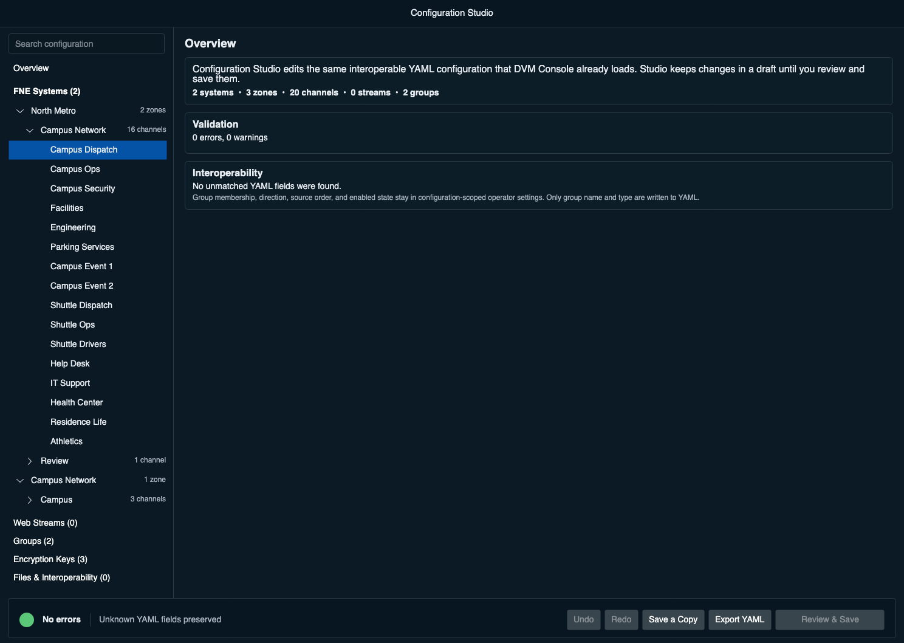
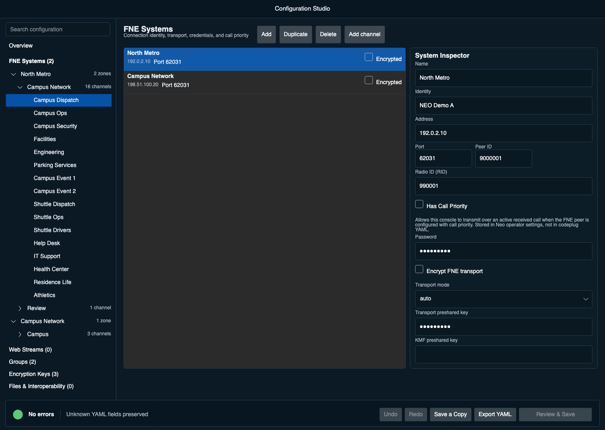
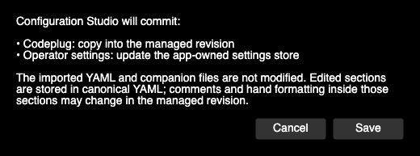

# Configuration Studio and codeplugs

Configuration Studio edits an app-owned configuration. YAML remains the
interoperable import/export format, but an imported file is no longer the live
backing file. DVM Console copies the YAML and approved companion files into the
Configuration Library, assigns a stable configuration ID, and commits immutable
revisions. Studio keeps changes in a draft until you review and save them.

Open the current codeplug from:

```
File > Configuration Studio
```

To create a configuration from scratch, choose **File > New Configuration**.
To import an existing YAML codeplug, choose **File > Import Codeplug**. The
Studio is a separate, modeless window, so you can refer to the main console
while editing. Opening a Studio section again brings the existing window
forward.

**File > Open Recent** lists recently opened managed revisions, not external
YAML paths. Use it to return to a configuration that is already in the library.

Use **File > Configuration Library** to activate, duplicate, remove, or restore
managed configurations. Only committed revisions can be activated. Removing an
inactive configuration moves it to recoverable library trash; it never deletes
an imported source file.



## Importing an existing codeplug

On the first upgraded launch, DVM Console imports the previous
`LastCodeplugPath` before creating the session. Other recent paths remain lazy
legacy candidates and are imported only when selected. A command-line YAML path
is imported and activated.

Import identity includes the source origin, YAML content, resolved companion
mapping, and companion hashes. Reopening an unchanged source reuses the managed
entry. If only the source changed and the managed entry has not diverged, the
import appends a revision. If both changed, DVM Console asks whether to import
as new, replace with a recoverable revision, or cancel; it does not merge YAML.

Safe same-folder key and alias references are copied automatically. Absolute or
out-of-tree companions require explicit approval or selection. Missing-file
warnings remain visible, and a reimport never silently substitutes a stale
managed companion.

Legacy card positions and other safely attributable operator state move to the
managed configuration ID during import. Ambiguous state is assigned only to the
previously active codeplug, and security-sensitive web-stream authorization is
never guessed.

## Finding and editing configuration

The left side groups each zone and channel directly beneath its FNE system;
there is no duplicate top-level Zones & Channels item. Open a system to see its
zones, then open a zone to see its channels. The disclosure arrows show which
branches can be opened or closed, including the currently selected branch.
The complete navigation rail scrolls when the pointer is over either the tree
or the surrounding section links. Search checks the complete hierarchy as well
as the other Studio sections.

Most editors use the same layout:

- The center table shows many records at once.
- The inspector on the right edits the selected record.
- Add, duplicate, delete, and reorder controls sit beside the table they affect.
- The status bar reports errors and warnings for the whole draft. Select it to
  open the validation drawer and see the section, field path, and explanation
  for each issue.

An error prevents saving. A warning calls attention to a usable but potentially
unsafe value, such as an unencrypted HTTP stream.

Undo and redo cover draft edits. Closing a changed draft asks before discarding
it.

## Systems

The FNE Systems page covers the connection name, identity, address, port, peer
ID, console RID, call-priority policy, password, transport encryption,
transport mode, transport preshared key, and KMF preshared key. Select **Add
channel** to open a new channel for the selected FNE; Studio creates that
system's first zone when needed. RID alias ownership and import are managed
under **Files & Interoperability**.

Passwords and preshared keys stay masked. Validation messages name the field but
never include its value. Port and Peer ID are plain numeric text fields without
increment/decrement spinner buttons.



The FNE transport is a compatibility protocol. Use it on a trusted network or
an authenticated VPN. Enabling transport encryption requires a transport
preshared key. The KMF preshared key has a separate purpose and is not reused as
the transport key.

## Zones and channels

Open an FNE system in the left hierarchy and select one of its zones. Each zone
is assigned to one FNE system. The zone inspector shows that assignment and
lets you change it. Studio then writes the selected system into every channel's
existing YAML `system` field. There is no separate system selector for each
channel.

Channel fields include destination ID, mode, algorithm, key ID, selectable
encryption, receive-only state, resource color, and card size. DMR channels
also include a slot. The valid card sizes are `small`, `normal`, and `large`.
The channel list has its own scrollbar, so the layout drawer never hides rows
that still need editing.

On desktop-sized Studio windows, edit the channel name, destination ID, mode,
DMR slot, encryption algorithm, receive-only state, and card size directly in
the table. Selecting or focusing an inline editor also selects that channel;
the table and right-side inspector stay synchronized and share the same
validation and Undo/Redo history. Use the inspector for key ID, selectable
encryption, and resource color. When the inspector would leave too little room
for usable columns, Studio switches to a compact channel list and keeps the
selected channel's fields in the inspector instead of clipping table values.

Select several channel rows to apply the current card size or change their
receive-only state together.

Select **Live zone layout** at the bottom of the channel table to open the
layout drawer. It uses the same card width, height, spacing, controls, colors,
and two-dimensional canvas as the main console. The card controls are disabled
in the drawer. Select a table row to find its card, then drag the card to its
new position. Studio stores those positions in operator settings when you
save. The running console keeps its current layout until you reload the saved
codeplug.

A compatible older codeplug may contain a zone whose channels name different
systems. Studio places that zone under **Unassigned or mixed**. Choose the
correct FNE in the zone inspector to make the assignment consistent before
saving.

The encryption algorithm list changes with the channel mode. It shows the
supported names instead of asking for a protocol number. Key IDs are shown in
hexadecimal. The `0x` prefix stays in the field, so you enter only the digits
that follow it.


The main operator workspace keeps its existing card layout and controls.
Configuration Studio is the place to edit definitions and prepare a layout.

## Encryption keys and RID aliases

The first time you select **Add** under Encryption Keys, Studio creates a
managed `keys.clear` companion if the configuration does not already reference
one. Enter the key protocol, algorithm, hexadecimal key ID, and key material,
then select the channel and use the same algorithm and key ID there.

Under **Files & Interoperability**, use **Browse…** to choose an existing key
file. For RID aliases, select the owning FNE and use **Choose file…** to open
the operating system's file picker. Studio parses the selection, copies its
contents into that FNE's current managed draft, and replaces only that FNE's
portable reference. The original file and other FNE alias lists are never
edited, and internal managed-runtime paths are not shown in the alias table.

If the selected FNE has no alias file, one **Add** creates its managed
`aliases.yml` companion and selects the first editable row. Enter the RID and
alias in the fields below the list; the selected row updates immediately.

When a new configuration has an FNE system but no zone, adding the first
channel creates the required zone automatically. This keeps the initial setup
path continuous from FNE system to channel and encryption.

## Web streams

The Web Streams page shows streams from every zone in one table. The owning zone
is still explicit. Moving a stream to another zone changes where its
`web_streams` entry is written.

Each stream has a name, URL, optional Basic Auth username and password, and idle
color. Use a direct HTTP or HTTPS audio URL. HTTPS is preferred. Stream
credentials are stored in the codeplug, so protect the file accordingly.

Web streams are local monitor widgets. They cannot be patch or multi-select
members.

## Review and save

Select **Review & Save** when the draft is ready. The review lists the managed
YAML, referenced key or alias companions, and configuration-scoped operator
state that will be committed.

If the draft has an error, **Review & Save** opens the validation drawer. Select
an issue to open the record that needs attention. Warnings remain visible but
do not prevent saving.



Studio performs these checks before committing a revision:

1. It validates the complete draft and its cross-references.
2. It verifies the active Studio draft and managed companion set.
3. It writes a new immutable revision and atomically updates the catalog.
4. It leaves every imported source file unchanged.

Saving the active configuration does not change the running FNE session. The
library marks the entry **Pending Reload**. Choose **Disconnect and reload** to
activate that committed revision, or leave the current session on its earlier
revision and reload later.

**Save a Copy** creates a new configuration ID. It copies non-trust
configuration state but does not copy import provenance or automatic web-stream
authorization.

## Full and sanitized exports

**Export YAML** and Files & Interoperability provide two export choices:

- A full interoperable copy includes credentials, operational addresses, stream
  URLs, identifiers, and references to local key material. Treat it as a
  secret.
- A sanitized support copy removes those values and is suitable for attaching
  to a troubleshooting report. Removed required identifiers are replaced with
  non-secret placeholders so the support copy remains valid YAML that DVM
  Console can import for diagnosis.

Exports use the platform's selected document handle. Companion files are
written beside the YAML with safe relative references, and DVM Console reads
the exported bundle back before reporting success. Export never changes the
current configuration ID, active revision, or Studio dirty baseline.

Review the sanitized copy before sharing it. Site-specific names may still be
meaningful even after credentials and identifiers are removed.

## YAML interoperability

Studio exports the same codeplug fields used by DVM Console's runtime loader.
It does not put group membership, direction, source order, or enabled state
into YAML. Older compatible DVM Console versions can therefore load a full
export produced by Studio.

Unmatched mapping fields, including legacy fields ignored by the current typed
model, are retained while their containing record remains in the draft. Studio
uses canonical formatting for edited sections. Comments and hand formatting in
those sections may change.

YAML anchors, aliases, custom tags, duplicate keys, and multi-document files
cannot be rewritten safely. Studio opens such files read-only. Maintain those
constructs by hand or save a compatible copy without them.

Legacy `patchGroups` entries still load. Studio writes group definitions under
`groups` when it rewrites that section.

## Manual YAML reference

A codeplug has `systems` and `zones` lists. Common optional fields are `groups`,
`keyFile`, and `patchSourceIdPassthrough`. Streams remain under their owning
zone as `web_streams`.

```yaml
keyFile: "./keys.clear"

systems:
  - name: "System 1"
    identity: "Console 1"
    address: "fne.example.local"
    port: 62031
    peerId: 1000001
    rid: "1001"
    password: "RPT_PASSWORD"
    encrypted: false
    transportEncryptionMode: "auto"
    aliasPath: "./alias.yml"

groups:
  - name: "Dispatch Patch"
    type: "patch"

zones:
  - name: "Primary"
    tabColor: "#E57373"
    tabTextColor: "#000000"
    channels:
      - name: "Channel 1"
        system: "System 1"
        tgid: "2001"
        mode: "p25"
        keyId: 0x50
        algo: "aes"
        selectable_encryption: true
        resourceColor: "#150282"
        rx_only: false
        card_size: normal
    web_streams:
      - name: "Stream 1"
        url: "https://streams.example.local/stream-1"
        idleColor: "#150282"
```

Channel `mode` accepts `p25`, `dmr`, `nxdn`, or `analog`. Studio displays the
YAML value `p25` as **P25 Phase 1**. That value will continue to mean Phase 1
when Phase 2 support is added. P25 Phase 1 has no timeslots, so Studio hides the
slot field for those channels. DMR channels use whole-number `slot` values 1 or
2. NXDN destination IDs are limited to 16 bits. A receive-only channel cannot
be a patch destination or another transmit target.

`patchSourceIdPassthrough` controls the source ID used for forwarded patch
traffic. When it is false, forwarding uses the configured console RID for the
destination system. When true, DVM Console attempts to retain the inbound
source ID.
