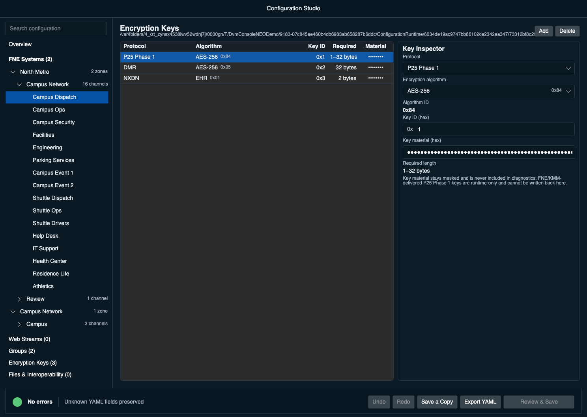

# Encryption keys

Encryption keys allow the console to decrypt and transmit protected P25 Phase
1, DMR, and NXDN 4800 voice traffic when supported by the connected FNE system.

DVM Console can obtain P25 Phase 1 key material from two places. After an FNE
connects, the console requests every configured P25 Phase 1 algorithm and key
ID through KMM. A valid key from that FNE takes precedence over the local YAML
fallback. DMR and NXDN privacy keys come from the local YAML file.

Open **File > Configuration Studio**, then select **Encryption Keys** to edit
the referenced local key file. Choose a protocol, then choose an algorithm by name. Studio
fills in the protocol-specific algorithm ID for you. For example, P25 Phase 1
AES-256 uses `0x84`, while DMR AES-256 uses `0x05`. The table shows both the
name and ID so the saved value is easy to check. The inspector never displays
key material as plain text.

Key IDs are hexadecimal. Studio keeps `0x` in front of the field and accepts
the digits that follow it. The key file table also shows IDs with the prefix.



The page edits local YAML keys only. FNE/KMM availability is runtime status and
cannot be written back to the file. Use **Tools > Encryption Key Status** when
you need to see whether the running console has a local or KMM-delivered key.

Keys are isolated by FNE system. Two systems can use the same algorithm and key
ID with different material. KMM-delivered keys stay in memory only. When the
system disconnects, DVM Console removes them and uses the local fallback again.

---

# FNE compatibility

Encryption and key management depend on the connected FNE. Test key delivery,
algorithm support, and encrypted voice against the exact FNE build used in the
deployment.

---

# Managed key file

If the configuration does not have a key file, selecting **Add** on the
Encryption Keys page creates a managed `keys.clear` companion and the first
editable entry. To use an existing key file, open **Files & Interoperability**
and select **Browse…**. Studio copies the selected file into the managed draft;
it does not edit the external source.

A portable exported codeplug uses a relative reference:

```yaml
keyFile: "./keys.clear"
```

The key file is optional when FNE/KMM supplies every required P25 Phase 1 key.
DMR and NXDN privacy keys use the managed local key file.

---

# Key file format

The key file contains a `keys` list.

Example:

```yaml
keys:
  - protocol: "p25"
    keyId: 0x1
    algId: 0x84
    key: "000102030405060708090A0B0C0D0E0F101112131415161718191A1B1C1D1E1F"

  - protocol: "dmr"
    keyId: 0x2
    algId: 0x05
    key: "000102030405060708090A0B0C0D0E0F101112131415161718191A1B1C1D1E1F"

  - protocol: "nxdn"
    keyId: 0x3
    algId: 0x01
    key: "1234"
```

Fields:

- `protocol`: `p25`, `dmr`, or `nxdn`. Studio displays `p25` as P25 Phase 1.
  Entries without this field remain P25 Phase 1 for compatibility with existing
  key files.
- `keyId`: hexadecimal key ID referenced by channels. NXDN key IDs are 1
  through 63.
- `algId`: algorithm ID.
- `key`: key material as hexadecimal without spaces or separators. P25 Phase 1
  keeps its established compatibility rules. DMR ARC4 uses 5 bytes, DES-OFB
  uses 8, and AES-256 uses 32. NXDN EHR uses a non-zero 15-bit seed stored in 2
  bytes, DES uses 8 bytes, and AES-256 uses 32.

Algorithm IDs are protocol-specific and are not interchangeable. Configuration
Studio chooses the ID from the protocol and algorithm name. In YAML, P25 Phase
1 AES-256 uses `algId: 0x84`, while DMR Association AES-256 uses `algId: 0x05`.
A DMR key must also declare `protocol: "dmr"`; an entry without `protocol` is
treated as P25 Phase 1 for compatibility with older key files.

---

# Channel encryption fields

Encrypted channels can include:

```yaml
keyId: 0x50
algo: "aes"
```

Supported `algo` values include:

- `aes`
- `des` or `des-ofb`
- `arc4` or `adp`
- `none`

For NXDN, use `ehr`, `des`, or `aes`. NXDN 9600/EFR is not implemented in dvmhost.

Configuration Studio writes channel key IDs with a `0x` prefix. The runtime
still accepts existing unprefixed values. Unprefixed P25 Phase 1 values retain
the legacy WPF hexadecimal interpretation, while unprefixed DMR and NXDN values
retain their decimal interpretation.

If `keyId` is blank or zero, DVM Console treats the channel as clear.

---

# Selectable encryption

P25 Phase 1, DMR, and NXDN secure-capable channels can expose an in-card
encryption toggle:

```yaml
keyId: 0x50
algo: "aes"
selectable_encryption: true
```

When enabled, the resource card shows **SELECT** beside the TAR indicator.
Click **SELECT** to switch transmission between encrypted and clear for that
system and talkgroup.

DVM Console saves the selected clear or encrypted state across restarts. The key
and algorithm still come from the codeplug. **CLEAR** sends clear audio, while
**SECURE** sends encrypted audio. This selection affects transmit only: clear
receive audio remains available in either state. DVM Console decodes an incoming
secure call when its on-air metadata identifies an available configured key.
The same receive behavior applies to fixed secure channels.

DMR secure calls also carry late-entry MI fragments and burst-F algorithm and
key identifiers. The reviewed `dvmhost r05a06_dev` clears burst F during RF
regeneration, so that identity does not survive end to end through that host
revision. NXDN DES/AES calls alternate `VCALL` and successor-IV metadata in
SACCH while voice continues. When the host preserves the required startup MI,
the receiver can recover at the next eight-frame encryption-session boundary.

---

# FNE key requests

After an FNE connection completes, DVM Console requests the distinct algorithm
and key IDs used by that system's encrypted P25 Phase 1 channels. The system
`rid` identifies the requesting console and must be a valid, nonzero 24-bit ID.

DVM Console does not request or use the FNE key inventory. An automatic KMM
request therefore needs a nonzero `keyId` and supported `algo` on at least one
P25 Phase 1 channel. KMM supplies the requested material; it does not assign
keys to channels or send a channel-to-key list.

A valid KMM key becomes active for the system that delivered it. DVM Console
never applies a response from one FNE to another, even when both use the same
algorithm and key ID. If the connection drops, DVM Console removes its KMM keys
and restores any available local keys.

Clear and MI-instruction KMM responses are accepted. Peer-encrypted KMM
responses require the system's separate `kmfPresharedKey`; the FNE transport
`presharedKey` is never reused for this purpose.

---

# Key status

Open **Tools > Encryption Key Status** to inspect key availability for
configured encrypted resources. Available entries identify the active source as
**local file** or **FNE/KMM**.

When a supported local DMR key is unavailable, its row shows the required
`protocol`, `algId`, and key length. The page never shows the key value.

The status page shows identifiers and availability only. Key material is never displayed or written to the debug log.

If an encrypted channel does not decrypt correctly:

- verify the channel `keyId`
- verify the channel `algo`
- verify the key file path
- verify that the FNE is connected
- verify that the FNE has delivered required key material

---

# Safety notes

- Protect clear key files.
- Do not commit operational key material to source control.
- Use test keys for development environments.
- KMM-delivered key material is never written back to the local key file.
