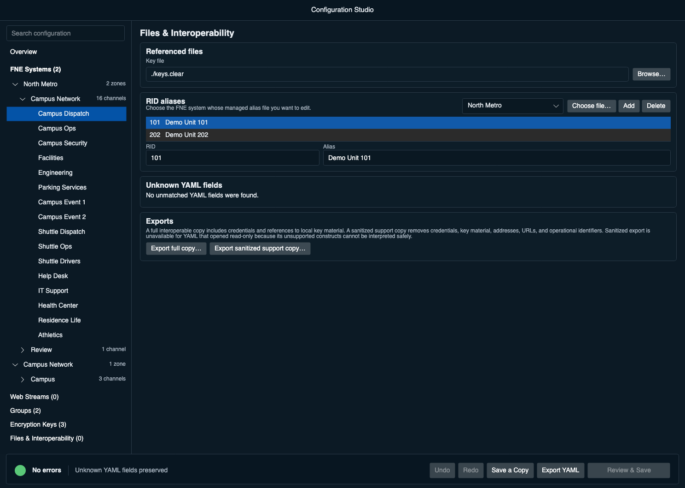

# RID aliases

RID aliases give radio IDs human-readable names in the console.

Aliases can appear in places such as:

- source alias on channel cards
- call history
- receive activity display
- logs or status views that resolve subscriber IDs

---

# Alias ownership and managed storage

Alias lists belong to an FNE system. A portable exported codeplug references
the companion by a relative filename:

```yaml
systems:
  - name: "System 1"
    aliasPath: "./aliases-system-1.yml"
```

If no alias file is configured or the file is unavailable, DVM Console shows
numeric RIDs.

Under **Files & Interoperability**, choose the FNE whose aliases you want to
edit. The list shows RIDs and aliases, not internal managed-storage paths.

- Select **Choose file…** to open the operating system's file picker. Studio
  parses the selected YAML, copies its contents into the current managed draft,
  and replaces only the selected FNE's managed alias copy. The external source
  and other FNE alias lists remain unchanged.
- If that FNE has no alias list, select **Add**. Studio creates a portable
  managed `aliases.yml` companion and immediately selects its first row for
  editing.
- Select an existing row to edit it, or select **Delete** to remove it.

Saving includes changed alias companions in the same review and backup
transaction as the managed codeplug.



---

# Alias file format

An alias file is a YAML list.

```yaml
- alias: "User 1"
  rid: 101

- alias: "User 2"
  rid: 102

- alias: "User 3"
  rid: 103
```

Fields:

- `alias`: display name.
- `rid`: radio ID.

Each RID should appear only once in the file.

---

# Operational notes

- Alias files are configured per system.
- A RID may have different meanings on different systems, so keep alias files system-specific when needed.
- If source aliases stop appearing but calls still log correctly, select the
  FNE under **Files & Interoperability** and verify that its managed list has
  the expected entries.
- Alias display does not change the actual source ID sent over the network.
