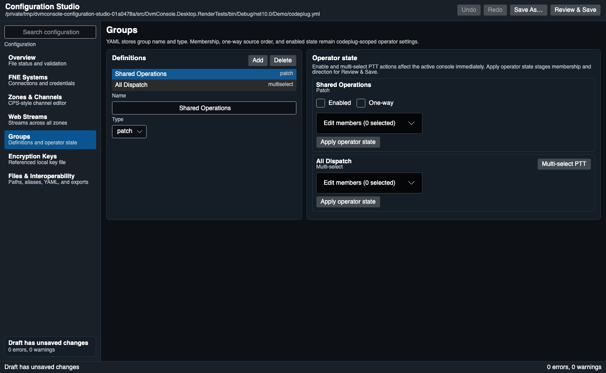

# Groups and patching

Manage patch and multi-select groups in Configuration Studio.

Open it from:

```
View > Groups
```

**View > Groups** opens Studio on the Groups page. The codeplug stores each
group's name and type. DVM Console stores membership, one-way direction, source
order, and enabled state in operator settings under the codeplug's normalized
path. Two codeplugs can use the same group name without sharing state.



When Studio is editing the active codeplug, enable controls and multi-select PTT
remain operational. They take effect immediately. Those controls are disabled
for a new, inactive, or unsaved codeplug.

---

# Patch groups

A patch group forwards received audio from one member to other members in the
group.

DVM Console applies the source system's adaptive receive jitter buffer once,
then decodes the source to 8 kHz PCM and re-encodes it for each destination
protocol. Destination audio follows the protocol's 20 ms transmit clock instead
of arriving in decoded batches. This allows cross-protocol patches; source
vocoder codewords are not passed directly to destinations.

Patch groups have two separate pieces of state:

- membership
- active/on-off state

Membership can exist while the patch is disabled.

---

# Enabling and disabling patches

Each patch group has an **Enabled** control on the Groups page.

When a patch is disabled:

- members stay assigned
- patch forwarding is inactive
- any active destination transmission is ended
- delayed or stream-ID-rewritten FNE echoes are briefly excluded from other patch routes during teardown
- channel cards can still show that the resource belongs to a patch

When a patch is enabled:

- patch forwarding can occur between members
- member card indicators show the active patch icon

Patch membership always persists across restarts.

The active state is restored only when **Settings > Retain Patch State on
Startup** is enabled.

If the setting is off, patches start disabled after a restart but retain their
members.

---

# Two-way patches

When **Enable One-Way Patch** is off:

- Patch Mode: Two-Way
- All members can transmit and receive.

Any listed member can become the active source. Audio received from that source
is forwarded to the other members.

---

# One-way patches

When **Enable One-Way Patch** is on:

- Patch Mode: One-Way
- Choose the source explicitly from the selected members.
- All other selected members are destinations and receive audio.
- An RX-only channel can be the source, but every destination must be transmit-capable.

DVM Console stores the source first for compatibility with existing
configurations. When it loads an older one-way patch, the first saved member
becomes the source.

```
Member 1 = Source
Members 2+ = Destinations
```

Change the **Source** selector and save the group to route the patch in the
other direction.

---

# Multi-select groups

A multi-select group lets an operator transmit to several member resources at
once with **Multi-Select PTT**.

Unlike a patch group, a multi-select group does not forward received audio
between members.

Use multi-select to key several resources together from the console.

---

# Editing members

To edit a group:

1. Open **View > Groups**.
2. Find the required patch or multi-select group.
3. Expand **Edit members** and check each channel that should be a member.
4. For a patch, select **Enabled** and **One-way** as required.
5. For a one-way patch, choose the source. The other selected members are destinations.
6. Select **Apply operator state**.
7. Use **Review & Save** to write the membership and direction changes.

DVM Console shows a conflict warning when a channel assignment cannot be used
safely. Resolve the conflict before using the group.

Applying operator state stages membership and direction in the Studio draft.
Group definition changes, including a rename or deletion, also wait for Review
& Save. The review includes the matching operator-settings rename or removal.

An **Enabled** change still takes effect on the active console immediately. It
uses the last saved membership until the draft is saved and the codeplug is
reloaded.

---

# Group PTT

Multi-select groups have a group PTT button. Enabled patch groups forward
received traffic and do not need a separate operator PTT control on this page.

DVM Console adds a short transmit tail after de-key so call-end signaling does
not clip the final audio frames.

---

# Card icons

Resource cards show an indicator for patch or multi-select membership.

If a resource belongs to both a patch and a multi-select group, the multi-select
indicator takes priority in the card indicator area.

---

# Persistence summary

| Item | Persists by default | Notes |
| --- | --- | --- |
| Patch members | Yes | Always sticky |
| Patch enabled state | No | Only sticky when Retain Patch State on Startup is enabled |
| Multi-select members | Yes | Stored for the current codeplug path |
| Edit mode | No | Clears when editing stops or the Groups window closes |

---

# Operator tips

- Use patch groups for cross-resource receive forwarding.
- Use multi-select groups for console-originated group transmit.
- Verify the source and destination summary before enabling a one-way patch.
- Disable a patch instead of removing members when you want to keep the setup for later.
