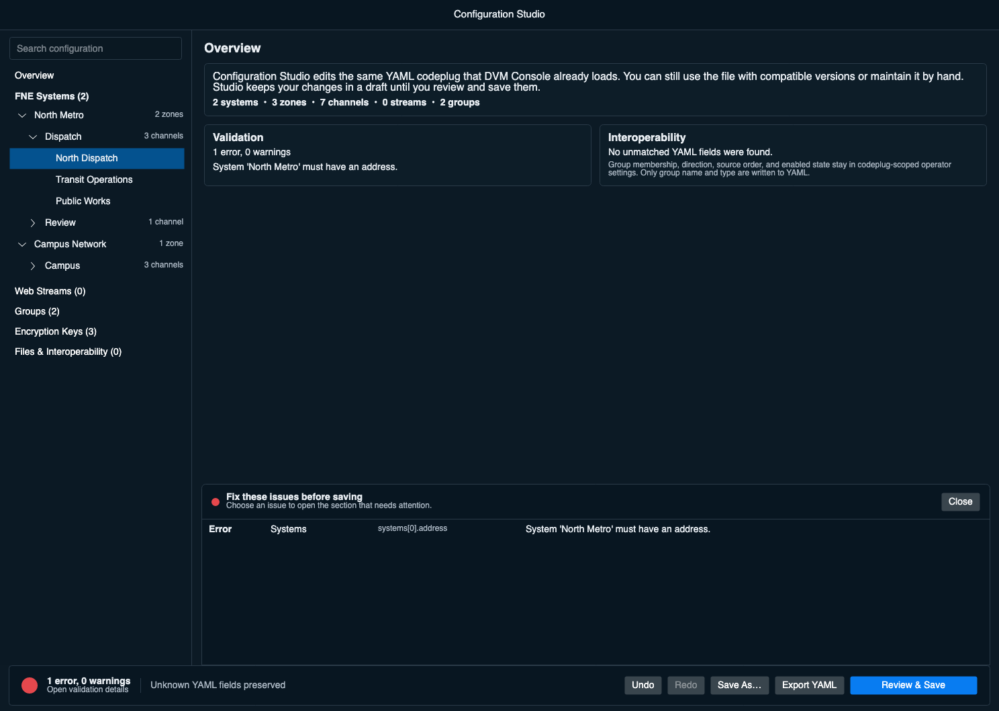

# Configuration troubleshooting

## A referenced file is missing

Open **Files & Interoperability** and check `keyFile` and each system's alias
path. Relative paths start from the codeplug's folder. A missing key file blocks
secure operation for keys that are not available through FNE/KMM. A missing
alias file leaves calls usable but shows numeric RIDs.

## Review & Save is disabled by errors

Select the error count in the bottom bar to open the validation drawer. Each row
shows the section, field path, and explanation. Select a row to open the record
that needs attention. **Review & Save** opens the same drawer automatically
when an error blocks the save. Warnings do not block saving.

Common errors include a channel that refers to a renamed system, a duplicate
system or channel identity, an invalid destination ID, an unsupported card size,
and malformed hexadecimal key material.

For channel encryption, choose an algorithm from the list for that mode. Enter
only the hexadecimal key ID digits after the fixed `0x` prefix. In the local key
editor, choose the protocol before the algorithm so Studio can use the correct
algorithm ID.

## A zone appears under Unassigned or mixed

Every zone should use one FNE system. Studio places a zone under **Unassigned
or mixed** when its existing channels refer to different systems or to a system
that is not defined. Select the zone, choose its FNE in **Zone settings**, and
save. Studio updates the existing `system` field on every channel in that zone.

## Group controls are unavailable

Enable and multi-select PTT controls work only when Studio is editing the
codeplug loaded in the main console. Save a new draft, load it in the console,
and reopen the Groups page to use those controls.

## A file changed outside Studio

Studio compares each source file with the copy it opened. If the hashes differ,
it will not overwrite the external change. Save the draft as a copy, or close
and reopen Studio to work from the changed file.

## The codeplug saved but the console did not change

Saving does not hot-apply systems, zones, channels, or streams to a running
session. Choose **Disconnect and reload** after Review & Save, or load the saved
codeplug later with **File > Open Codeplug**.

## Reload failed

The existing session is replaced only after DVM Console can load and validate
the saved codeplug. If reload fails, read the error, correct the draft, and try
again. Backups from the save remain under the DVM Console application data
folder in `ConfigurationBackups`.

## Studio opened the YAML read-only

Anchors, aliases, custom tags, duplicate keys, or multiple YAML documents cannot
be retained safely by the writer. Studio shows the file without allowing a
rewrite. Remove those constructs in a text editor or make a simpler compatible
copy.
